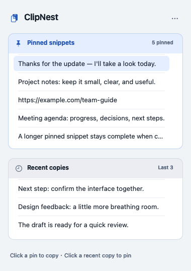
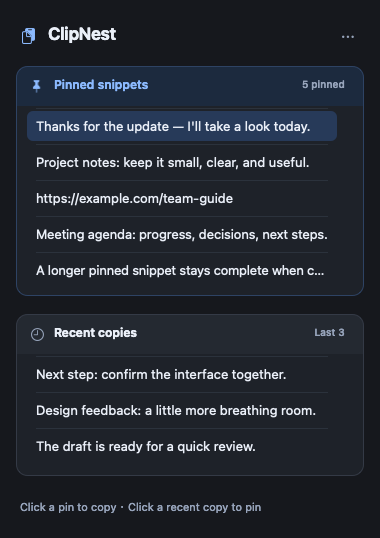

# ClipNest

A minimal **macOS menu bar clipboard manager** with **pinned snippets** and only your **last 3 distinct clipboard entries**. Pin as many text snippets as you need; the three-entry limit applies only to recent history. No search, cloud sync, or endless history.

## How it works

Light and dark appearances follow macOS automatically. Pinned snippets and recent copies use separate rounded cards with blue and neutral headers and an 18-point gap; only pinned snippets need to scroll.

The clipboard icon stays in the menu bar, with no Dock icon or ordinary application window. Click it to open two simple row lists:

- **Pinned snippets:** click a row to copy its full text. Pins have no three-item cap; the list scrolls.
- **Recent 3:** newest first. Click a row to pin it; duplicate pins are ignored.
- Drag a pin at least 5 points to reveal the red trash row. Release inside it to delete; releasing elsewhere or pressing Escape cancels. Settings → Undo Delete restores the last deleted pin during this session.
- Settings also offers pause/resume capture, About & Privacy, and Quit. Nothing enables launch at login automatically.

Long text is shown as a single truncated preview; the full text is kept. Arrow keys or Tab select rows, Return/Space copy or pin, Command-Delete asks before deleting a selected pin, Command-Z undoes deletion, Command-Comma opens Settings, Command-Q quits, and Escape closes the panel.

## Screenshot





[Dark drag-to-trash preview](docs/drag-trash-dark.png) · [Update-row preview](docs/update-dark.png)

These review screenshots are rendered from the actual AppKit panel with synthetic data in an isolated QA mode. The list demonstrates pinned snippets exceeding three and recent history capped at three. They are layout previews, **not evidence of a completed real mouse/keyboard usability test**. No personal clipboard content is included.

## Install the development preview

Download [ClipNest 0.1.0 DMG](https://github.com/myerwang/clipnest/releases/download/v0.1.0/ClipNest-0.1.0-macos-arm64.dmg) for first installation (Apple silicon, macOS13+). Open the disk image, drag **ClipNest.app → Applications**, eject it, then launch ClipNest from Applications. The icon appears in the menu bar. Do not run from the read-only image. Verify the download with the release's `SHA256SUMS-DMG.txt` if desired.

The DMG contains the exact same app as the release ZIP, plus an Applications shortcut and installation instructions. **It is still ad-hoc signed and not notarized; a DMG does not bypass Gatekeeper.** No system security setting is changed. The original ZIP remains the signed Sparkle update archive.

## Build and run

Requires macOS 13 or later, Xcode/Apple Swift tooling. Sparkle 2.10.0 is the only external dependency, pinned exactly through Swift Package Manager.

```sh
./scripts/build.sh
open dist/ClipNest.app
```

The build script uses temporary Swift caches and the native SwiftPM build backend to avoid restricted cache writes and Xcode test-bundle extended-attribute failures observed in the development workspace. The backend flag is deprecated in Swift 6.4 but remains supported. On a normal unrestricted checkout, `swift build -c release` and `swift test` also work without these overrides.

The app is locally **ad-hoc signed, not notarized or signed by an Apple Developer distribution certificate**. It is a development MVP, not an App Store release. The DMG is recommended for first installation; the ZIP is kept for Sparkle updates and optional manual extraction. No installer or login item is added. Intel builds require building from source on Intel; the provided development build is arm64.

## Tests

```sh
swift test
# In a restricted Codex workspace:
CLANG_MODULE_CACHE_PATH=/tmp/clipnest-module-cache \
SWIFTPM_MODULECACHE_OVERRIDE=/tmp/clipnest-module-cache \
swift test --disable-sandbox --cache-path /tmp/clipnest-swift-cache \
  --scratch-path /tmp/clipnest-build --build-system native
# On macOS with pasteboard service access:
dist/ClipNest.app/Contents/MacOS/ClipNest --integration-test
# Optional manual UI QA, isolated from the general clipboard:
dist/ClipNest.app/Contents/MacOS/ClipNest --ui-test
```

Unit tests cover recent-history bounds/deduplication, eight pins, persistence and private file permissions, delete/undo order, corrupt-file preservation, failed-save rollback, and privacy markers. The integration test uses a unique named pasteboard and temporary storage to verify actual AppKit capture/copy, self-write suppression, privacy filtering, pause, five pins, recent three, deletion, undo and reload.

`--appearance-previews` exports actual light/dark panel previews by overriding only the isolated QA view's appearance, never the system theme. Normal operation leaves appearance inherited from macOS.

`--review-previews` renders the normal list, the same trash visual state used by drag handling, and an empty state; it does not synthesize mouse drags. Set a fresh `CLIPNEST_QA_DIR` to choose the output directory.

`--ui-test` uses a named private QA pasteboard and a temporary pins file. Its Settings menu has a synthetic-copy action and a panel-only screenshot action. Run with a fresh `CLIPNEST_QA_DIR` for a clean test. It never accesses the general clipboard. After testing, quit from Settings. Automated test success does not substitute for manual accessibility/drag usability checks.

## Privacy and storage

- Clipboard contents never leave the Mac. No app accounts, analytics, cloud clipboard services, or background uploads. Optional Sparkle update checks contact public GitHub over HTTPS; GitHub receives your IP address and ordinary HTTP metadata, but no clipboard data or system profiling.
- Recent text is memory-only and disappears on quit. The clipboard already present at app launch is ignored.
- Pins are saved atomically to `~/Library/Application Support/ClipNest/pins.json`, with directory mode 0700 and file mode 0600. **This is plain-text local storage, not encryption.** Do not pin secrets. Local disk access and ordinary system backups can include this file.
- All pasteboard-item types are checked before text is read. Concealed, private, password-manager, transient and autogenerated markers are excluded. Unmarked passwords/sensitive text cannot be reliably identified; pause capture when needed.
- No Accessibility, Input Monitoring, Screen Recording, or launch-at-login permission is requested. It does not automatically paste into other apps.
- Copying a pin updates the system clipboard but does not re-add it to recent history. Existing recent duplicates move to newest when another app copies them.

## Limits and validation status

Text only (maximum 1 MiB per entry); no images, rich text formatting, files, sync, global shortcuts, or persistent recent history. Polling every 0.5 seconds can miss very rapid intervening copies. Only the currently exposed text representation is stored. Privacy filtering relies on producer metadata and may conservatively exclude safe marked content. Corrupt pin files are preserved and cannot be overwritten by new pins; recover the local file before continuing.

Verified on an arm64 Mac with Swift 6.4: release build, six XCTest cases, and isolated AppKit integration checks. Real mouse drag/drop, keyboard operation, scrolling and GUI restart have **not yet been verified end to end** because native UI automation could not identify the accessory app. Linux cannot compile or test this AppKit application. Sparkle engine feed tests cover same/newer versions, interrupted networking, malformed XML and incompatible macOS. Signed-feed acceptance/rejection and independent official-tool archive/feed verification, including tamper rejection, also passed. Installer launch in the sandbox blocks the bad-signature download scenario before signature validation (error 4005); this is not a passing signature-rejection or replacement test.

ClipNest shares its name with existing clipboard tools; this project is independent and does not claim exclusive branding.

## License

MIT. See [LICENSE](LICENSE). Development instructions are in [AGENTS.md](AGENTS.md).

## Updates and release signing

Sparkle 2.10.0 handles updates. On second launch it asks whether to check daily (every 86,400 seconds); Settings → Check Daily for Updates changes that preference, and Check for Updates… performs a manual check. A discovered update adds only a bottom row, **发现新版本 · 更新**. Clicking it opens Sparkle's standard confirmation/download/restart interface. Automatic downloading and installation, system profiling, and system notifications are disabled. No GitHub token is embedded. A build lacking a valid public key disables updates entirely.

The feed is `https://raw.githubusercontent.com/myerwang/clipnest/main/appcast.xml`; archives live in GitHub Releases. This mutable main-branch URL requires the repository/path to remain stable and can be cached by GitHub/CDNs; checks may observe feed updates with a delay. No GitHub Pages configuration or server is required. HTTPS transport plus signed feed and Ed25519-signed archives are required; invalid feed signatures never fall back after a time limit. Archives are verified before extraction. macOS/architecture eligibility and version selection are handled by Sparkle.

The dedicated signing account is `app.clipnest.mac.updates` in the maintainer's login Keychain. Only `config/sparkle-public-key.txt` is public. **Never export the private key to the project, iCloud, GitHub or CI.** The maintainer should maintain a secure encrypted Keychain/system backup themselves: losing this key can strand updates because Developer ID key rotation is currently unavailable. Apple Developer ID signing and notarization are separate and are not configured. Ad-hoc builds can be blocked by Gatekeeper or app translocation; installing in a writable Applications directory is required for replacement. A real two-version install/relaunch test with isolated user data remains outstanding.

Maintainers: build first and run `python3 scripts/sign-release.py` to sign the archive/feed with the dedicated Keychain account and verify valid/tampered inputs. Run `python3 scripts/test-updates.py` for seven isolated engine scenarios; `--include-install-test` additionally tries the bad-signature download path (known installer-launch sandbox limitation in this environment). As an alternative, use Sparkle's official `generate_appcast --account app.clipnest.mac.updates --download-url-prefix https://github.com/myerwang/clipnest/releases/download/v0.1.0/ -o appcast.xml <isolated-archive-folder>`. Re-sign the appcast after any modification with `sign_update --account app.clipnest.mac.updates appcast.xml`; verify both feed and archives before publishing. Keep release archives immutable and increase CFBundleVersion for every update. Never change the key casually. See [Sparkle setup](https://sparkle-project.org/documentation/), [gentle reminders](https://sparkle-project.org/documentation/gentle-reminders/) and [configuration](https://sparkle-project.org/documentation/customization/).
