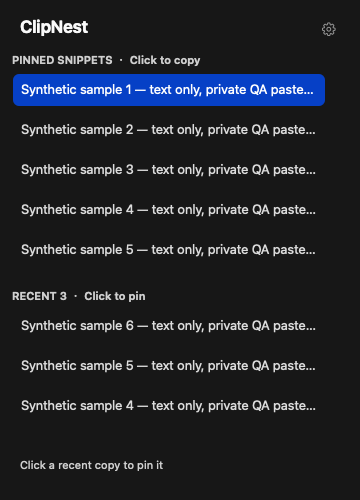

# ClipNest

A minimal **macOS menu bar clipboard manager** with **pinned snippets** and only your **last 3 distinct clipboard entries**. Pin as many text snippets as you need; the three-entry limit applies only to recent history. No search, cloud sync, or endless history.

## How it works

The clipboard icon stays in the menu bar, with no Dock icon or ordinary application window. Click it to open two simple row lists:

- **Pinned snippets:** click a row to copy its full text. Pins have no three-item cap; the list scrolls.
- **Recent 3:** newest first. Click a row to pin it; duplicate pins are ignored.
- Drag a pin at least 5 points to reveal the red trash row. Release inside it to delete; releasing elsewhere or pressing Escape cancels. Settings → Undo Delete restores the last deleted pin during this session.
- Settings also offers pause/resume capture, About & Privacy, and Quit. Nothing enables launch at login automatically.

Long text is shown as a single truncated preview; the full text is kept. Arrow keys or Tab select rows, Return/Space copy or pin, Command-Delete asks before deleting a selected pin, Command-Z undoes deletion, and Escape closes the panel.

## Screenshot



The screenshot is rendered from the actual AppKit panel with synthetic data in an isolated QA mode. It demonstrates pinned snippets exceeding three and recent history capped at three. It is a layout preview, **not evidence of a completed real mouse/keyboard usability test**. No personal clipboard content is included.

## Build and run

Requires macOS 13 or later, Xcode/Apple Swift tooling. No external dependencies.

```sh
./scripts/build.sh
open dist/ClipNest.app
```

The build script uses temporary Swift caches and the native SwiftPM build backend to avoid restricted cache writes and Xcode test-bundle extended-attribute failures observed in the development workspace. The backend flag is deprecated in Swift 6.4 but remains supported. On a normal unrestricted checkout, `swift build -c release` and `swift test` also work without these overrides.

The app is locally **ad-hoc signed, not notarized or signed by an Apple Developer distribution certificate**. It is a development MVP, not an App Store release. A release archive, when published, contains `ClipNest.app`; unzip and place it in Applications if desired. No installer or login item is added. Intel builds require building from source on Intel; the provided development build is arm64.

## Tests

```sh
swift test
# In a restricted Codex workspace:
CLANG_MODULE_CACHE_PATH=/tmp/clipnest-module-cache \
SWIFTPM_MODULECACHE_OVERRIDE=/tmp/clipnest-module-cache \
swift test --disable-sandbox --cache-path /tmp/clipnest-swift-cache \
  --scratch-path /tmp/clipnest-build --build-system native
# On macOS with pasteboard service access:
dist/ClipNest.app/Contents/MacOS/ClipNest --integration-test
# Optional manual UI QA, isolated from the general clipboard:
dist/ClipNest.app/Contents/MacOS/ClipNest --ui-test
```

Unit tests cover recent-history bounds/deduplication, eight pins, persistence and private file permissions, delete/undo order, corrupt-file preservation, failed-save rollback, and privacy markers. The integration test uses a unique named pasteboard and temporary storage to verify actual AppKit capture/copy, self-write suppression, privacy filtering, pause, five pins, recent three, deletion, undo and reload.

`--ui-test` uses a named private QA pasteboard and a temporary pins file. Its Settings menu has a synthetic-copy action and a panel-only screenshot action. Run with a fresh `CLIPNEST_QA_DIR` for a clean test. It never accesses the general clipboard. After testing, quit from Settings. Automated test success does not substitute for manual accessibility/drag usability checks.

## Privacy and storage

- No network requests, accounts, analytics, cloud services, or background uploads.
- Recent text is memory-only and disappears on quit. The clipboard already present at app launch is ignored.
- Pins are saved atomically to `~/Library/Application Support/ClipNest/pins.json`, with directory mode 0700 and file mode 0600. **This is plain-text local storage, not encryption.** Do not pin secrets. Local disk access and ordinary system backups can include this file.
- All pasteboard-item types are checked before text is read. Concealed, private, password-manager, transient and autogenerated markers are excluded. Unmarked passwords/sensitive text cannot be reliably identified; pause capture when needed.
- No Accessibility, Input Monitoring, Screen Recording, or launch-at-login permission is requested. It does not automatically paste into other apps.
- Copying a pin updates the system clipboard but does not re-add it to recent history. Existing recent duplicates move to newest when another app copies them.

## Limits and validation status

Text only (maximum 1 MiB per entry); no images, rich text formatting, files, sync, global shortcuts, or persistent recent history. Polling every 0.5 seconds can miss very rapid intervening copies. Only the currently exposed text representation is stored. Privacy filtering relies on producer metadata and may conservatively exclude safe marked content. Corrupt pin files are preserved and cannot be overwritten by new pins; recover the local file before continuing.

Verified on an arm64 Mac with Swift 6.4: release build, six XCTest cases, and isolated AppKit integration checks. Real mouse drag/drop, keyboard operation, scrolling and GUI restart have **not yet been verified end to end** because native UI automation could not identify the accessory app. Linux cannot compile or test this AppKit application.

ClipNest shares its name with existing clipboard tools; this project is independent and does not claim exclusive branding.

## License

MIT. See [LICENSE](LICENSE). Development instructions are in [AGENTS.md](AGENTS.md).
